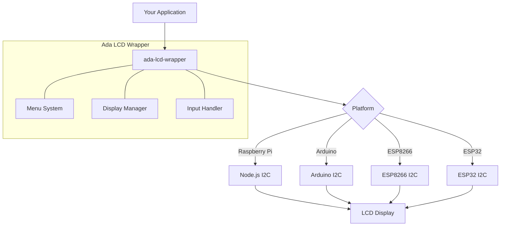
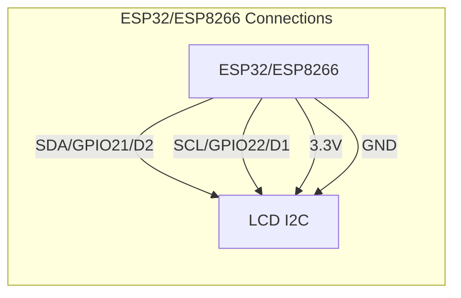
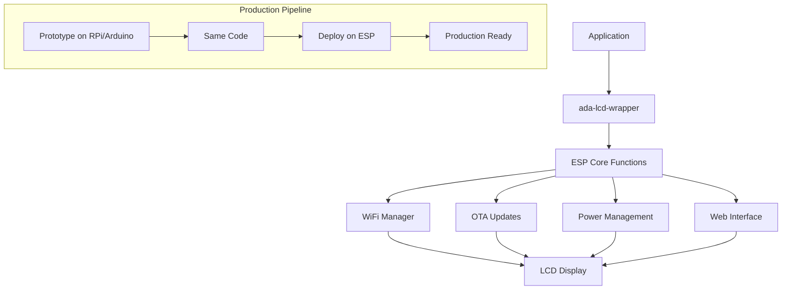

# Adafruit LCD Wrapper with ESP32/ESP8266 Support

A comprehensive wrapper for interfacing with Adafruit LCD displays across multiple platforms, now with enhanced support for ESP32 and ESP8266 microcontrollers. This library extends [the excellent original library](https://github.com/fehmer/adafruit-i2c-lcd) to provide a seamless transition path from prototyping to production.

## Features

- **Cross-Platform Consistency**: Same API works on Raspberry Pi, Arduino, and ESP32/ESP8266
- **Menu System**: Built-in support for navigable menus with action handlers
- **Enhanced ESP Support**: Optimized for ESP32 and ESP8266 with production-ready features
- **Power Efficiency**: Smart power management for battery-operated devices
- **WiFi Status Integration**: Display connection status and IP address
- **OTA Update Support**: Display update progress on the LCD

## System Architecture



## Hardware Connection



## Installation

### For Node.js (Raspberry Pi)
```bash
npm install ada-lcd-wrapper
```

### For Arduino/ESP8266/ESP32
```bash
# In Arduino IDE, go to Sketch > Include Library > Add .ZIP Library
# Then select the downloaded zip of this repository
```

## Basic Usage

### Node.js
```javascript
const LCDWrapper = require('ada-lcd-wrapper');

// Initialize with I2C address
const lcd = new LCDWrapper({
  i2cAddress: 0x27,
  rows: 2,
  cols: 16
});

// Display a static message
lcd.initialize()
  .then(() => {
    lcd.staticMessage('Hello, World!');
  })
  .catch(err => console.error('Error initializing LCD:', err));

// Create and display a menu
const menuItems = [
  { label: 'Status', action: showStatus },
  { label: 'Settings', action: showSettings },
  { label: 'Restart', action: restartSystem }
];

lcd.displayMenu(menuItems);
```

### Arduino/ESP32/ESP8266
```cpp
#include <ada_lcd_wrapper.h>

// Initialize with I2C address
AdaLCDWrapper lcd(0x27, 16, 2);

void setup() {
  lcd.initialize();
  lcd.staticMessage("Hello, World!");
  
  // Setup menu items
  MenuItem menu[] = {
    {"Status", showStatus},
    {"Settings", showSettings},
    {"Restart", restartSystem}
  };
  
  lcd.displayMenu(menu, 3);
}

void loop() {
  lcd.handleButtons(); // Process button presses
  delay(100);
}

// Menu action handlers
void showStatus() {
  lcd.staticMessage("Status: OK");
}

void showSettings() {
  lcd.staticMessage("Settings Menu");
}

void restartSystem() {
  lcd.staticMessage("Restarting...");
  delay(1000);
  ESP.restart();
}
```

## ESP32/ESP8266 Production Features

The ESP integration includes several features designed specifically for production environments:



### WiFi Manager Integration

```cpp
// ESP8266/ESP32 Example
#include <ada_lcd_wrapper.h>
#include <ESP8266WiFi.h>

AdaLCDWrapper lcd(0x27, 16, 2);

void setup() {
  lcd.initialize();
  
  // Connect to WiFi with status on LCD
  lcd.staticMessage("Connecting WiFi");
  
  WiFi.begin("SSID", "password");
  
  while (WiFi.status() != WL_CONNECTED) {
    lcd.showProgress(WiFi.status());
    delay(500);
  }
  
  lcd.staticMessage("Connected!");
  lcd.setCursor(0, 1);
  lcd.print("IP: " + WiFi.localIP().toString());
}
```

## API Reference

### Functions

- `initialize()` - Initialize the LCD or throw an error if initialization fails
- `staticMessage(message)` - Clear screen and display a static message
- `displayMenu(items, property)` - Display a navigable menu with action handlers
- `handleButtons()` - Process button inputs (for Arduino/ESP platforms)
- `showProgress(percent)` - Display a progress bar (useful for OTA updates)
- `backlight(on)` - Turn the backlight on or off for power saving
- `createChar(location, charmap)` - Create a custom character

## Production Use Cases

- **Smart Home Control Panel**: Display and control home automation settings
- **Industrial Monitoring**: Show status of machinery and sensors
- **Retail Point-of-Sale**: Customer-facing display for transactions
- **Medical Devices**: User interface for medical monitoring equipment

## License

MIT

## TODO
- Unit Tests
- Mock LCD/LCD Simulator
- Additional ESP32-specific examples
